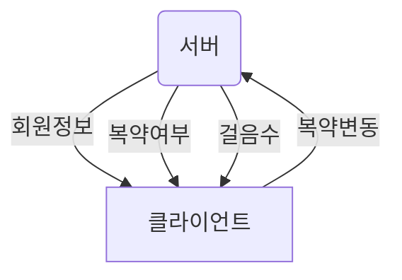

# 소개

- 내부 QA 위한 실시간 데이터 전송 소켓 입니다.

  - 매초 마다 데이터 확인합니다.
    클라이언트 접속하면 데이터 보내고 테이블 비웁니다.
    연결이 끊길경우 데이터 쌓아두고 클라이언트 접속하면 다시 전송하고 데이터 비웁니다.

- 항목
  - 회원정보 (송신)
  - 복약여부 (송신)
  - 걸음수 &nbsp;&nbsp;&nbsp;&nbsp;(송신)
  - 복약수정요청 (수신)

# 필요한 모듈

1. http
2. socket.io
3. mongoose

# 설치 방법

- 모듈별 설치

```node
  npm i socket.io
  npm i mongoose
```

- package.json 설치 방법

```node
  npm i
```

# 실행 방법

```node
  node app.mjs
```

# 함수
- 초 단위로 데이터 체크
  ```js
  setInterval(async () => {
    Object.keys(Tables).map(count);
  }, 1000);
  ```

- document 개수 카운트

  ```js
  async function count(item) {
      let [channel, db] = [item, Tables[item]];
      let count = await db.countDocuments({});
      message(count, channel, db);
  }
  ```

- 데이터 전송 및 삭제 (재귀 함수)

  ```js
  async function message(i, channel, db) {
    if (i == 0) return false;
    let data = await db.findOneAndRemove({});
    socket.emit(channel, data);
    message(i - 1, channel, db);
  }
  ```

# 송수신이벤트

- 송신 : app.js 약 14라인
  - 이벤트명
  json 파일 key 이벤트 명이 되며 value 는 db리소스가 됨

  ```
  let Tables = { user: Users, medicine: Medicines, step: Steps };

  socket.emit(이벤트채널, 전송내용);
  ```

- 수신 : app.js 약 34라인
  - 복약 수정 요청 이벤트
  ```js
  socket.on('medicine', (data) => {
    console.log(data);
  });
  ```

  - 연결 끊김 이벤트
  ```js
  socket.on('disconnect', () => {
      console.log(socket.id);
    });
  ```


# 통신 구조



# 데이터 구조 (json)

- 회원정보 (UserSchema)

|Name |Type| Description| Etc|
  | :------:| :---: | :---:| :--:|
  |project_id|String|프로젝트 아이디|required: true|
  |code|String|코드번호|unique: true|
  |name|String|이름||
  |gender|String|성별||
  |birth|String|생년월일||
  |age|String|나이||
  |contact|String|연락처||
  |disease|String|질환||
  |medicine_list|[Object]|약품목록||
  |take_medicine_time| [String]|복약 시간||
  |device|String|스마트워치 SN||
  |attend|Date|참가일|default: Date.now|
  |regdate|Date|가입일|default: Date.now|
  |state|Number|상태|

<br><br/>
- 복약 (MedicineSchema)

|parent_id|||
  | :------:| :---: | :---:|
|Name |Type| Description| Etc|
  |project_id|Object|프로젝트 아이디|
  |user_id|String|유저 아이디|

|data||||
  | :------:| :---: | :---:| :--:|
|Name |Type| Description| Etc|
  |file_name|String|동영상 파일||
  |guid|String|약에 부착된 beacon 고유번호||
  |title|String|약 이름|
  |time|String|복약 시간|
  |take_medicine| Boolean|복약 여부|default: false|
  |regdate|Date|가입일|default: Date.now|
  |updatetime|Date|업데이트 시간|default: Date.now|
  

- 걸음수 (StepShema)

|parent_id|||
  | :------:| :---: | :---:|
|Name |Type| Description|
  |project_id|Object|프로젝트 아이디|
  |user_id|String|유저 아이디|

|data||||
  | :------:| :---: | :---:| :--:|
|Name |Type| Description| Etc|
  |date|Date|걸음수 전송날짜|default: Date.now|
  |count|String|걸음수|default: '0'|
  <br><br/>
- 복약수정 요청

|parent_id|||
  | :------:| :---: | :---:|
|Name |Type| Description|
  |project_id|Object|프로젝트 아이디|
  |user_id|String|유저 아이디|

|data|||
  | :------:| :---: | :---:|
|Name |Type| Description|
  |take_medicine| Boolean|복약 여부|
  |_id|String|고유 id||
